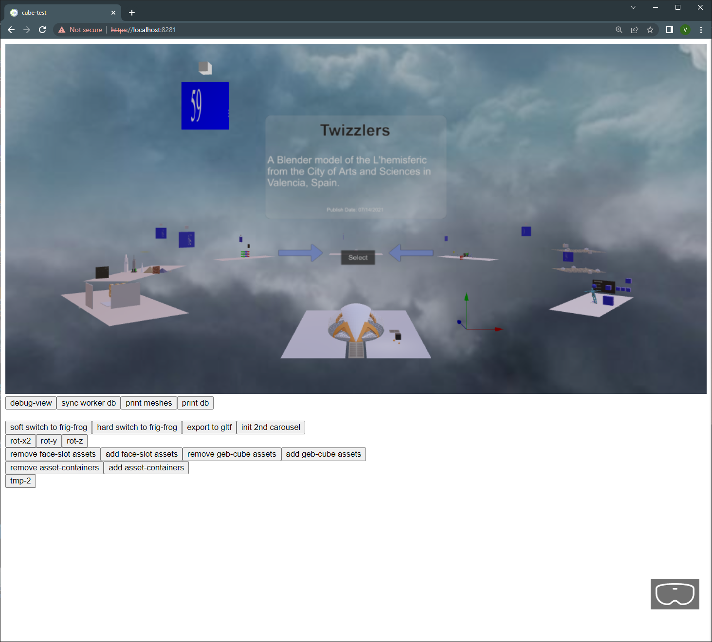
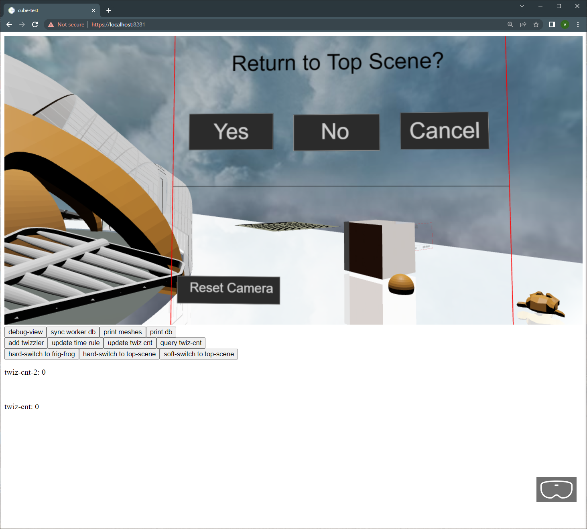

# cube-test

An example of some VR "games" written in Clojurescript and Babylon.js.  I have quotes around "games" because most are just simple scenes, that is to say more like prototypes of some ideas for fuller games or simulations.  After attempting to write a few "real" games, and realizing how hard it is, and feeling the need to get in some more quick iterations of the game writing process (to get more feedback and avoid getting bogged down in a single scene), I decided to just create a project where I would metaphorically start with a simple cube on a plane, the archetypal VR "hello world" program, and then try to expand it in the smallest possible way possible and hope to actually complete something.  Thus the name "cube-test".

If you want to try it out you can run it directly off github pages [here](https://vt5491.github.io/cube-test/resources/public/index.prod.html) .



### How to use
1.  Click on the "Enter VR" icon in the lower left corner to enter VR.  You can do a certain amount without entering VR, but this is really intended to be a pure VR app.
2. You can move around using standard Babylon.js teleportation buttons, or by pressing the left grip button and then flinging and releasing to get more of a flying motion (hard to describe, but easy once you get it).    Note: this is using an oculus rift controller as a reference, but it should work with other controllers as well.
3. Click on the arrows to rotate the "choice carousel" and then select the desired sub-scene.  Note: if you ever lose the "vr selection ray", just click on the floor and it should reemerge.
4. The right "A button" can be used to bring up a menu to allow you to return to the top-scene if you are in a sub-scene.



5.  The buttons at the bottom are just left-overs from development.


## Development Notes
The main thing about this project is it serves as a useful reference (at least to me) for how to do certain things in Babylon and clojurescript.  I'm always forgetting the details of how to load a model from blender, or do a map in clojure etc., so I just search on this project from git bash with something like:

```
vturner2@LAPTOP-F0QM306P MINGW64 /d/vtstuff_d/github/cube-test/src (master)  
$ find . -name "*.clj[cs]*" | xargs grep -i "load-model"  

```
and then I can find examples of how I did it before.

The directory structure is becoming quite elaborate, as I get more opinionated about how things should be.  That's the beauty of having multiple scenes in one project -- you don't think of a lot of things when there's just a single scene.  I have a main-scene (common to all scenes), and then scenes at the app level, and main-game, and an app-level game object.  I have 'cljs' and 'cljc' files as necessary and each sub-scene has it's own private directory and typically has it's own view, events, subs, rules, and db files.

I use re-frame as my main app engine.  When I first used re-frame, I didn't really exploit a reactive design. Once I started to understand reactive apps (about how you update the db to trigger an indirect update in a separate concern), I Unfortunately discovered that re-frame is interactive but not real-time.  That is to say re-frame events take on the order of 200ms which is about 10 ticks (at 60 fps) and it's uninterruptable. This might be acceptable in a web app (an interactive app), but is unacceptable in a game (a real-time app), causing a noticeable jerk in any real-time action that may be going on.

To get around this, I first experimented using web workers, which does address the problem, but has a pretty high overhead to using.  I then tried [o'doyle rules](https://github.com/oakes/odoyle-rules) which worked better and appears to be real-time.  You can see examples of both of these methods in the code base if you're motivated enough to search for them.

## Creating a production build
This is really more just a note for me, the developer.  I normally develop with:
```
lein.bat dev
```
However, to create a production build do:
```
lein.bat prod
```
This creates a file 'cube-test/resources/public/js/compiled/app.js'.  Copy this file to 'app.prod.js' in the same directory and then upload to the git repo.  After a couple of minutes (you may need to clear your cache) you should get an updated module at 'https://vt5491.github.io/cube-test/resources/public/index.prod.html'

## Original README notes (from the default re-frame project)...

A [re-frame](https://github.com/day8/re-frame) application designed to ... well, that part is up to
you.

## Getting Started

### Project Overview

* Architecture:
[Single Page Application (SPA)](https://en.wikipedia.org/wiki/Single-page_application)
* Languages
  - Front end ([re-frame](https://github.com/day8/re-frame)): [ClojureScript](https://clojurescript.org/) (CLJS)
* Dependencies
  - UI framework: [re-frame](https://github.com/day8/re-frame)
  ([docs](https://github.com/day8/re-frame/blob/master/docs/README.md),
  [FAQs](https://github.com/day8/re-frame/blob/master/docs/FAQs/README.md)) ->
  [Reagent](https://github.com/reagent-project/reagent) ->
  [React](https://github.com/facebook/react)
* Build tools
  - Project task & dependency management: [Leiningen](https://github.com/technomancy/leiningen)
  - CLJS compilation, REPL, & hot reload: [`shadow-cljs`](https://github.com/thheller/shadow-cljs)
* Development tools
  - Debugging: [CLJS DevTools](https://github.com/binaryage/cljs-devtools)

#### Directory structure

* [`/`](/../../): project config files
* [`dev/`](dev/): source files compiled only with the [dev](#running-the-app) profile
  - [`cljs/user.cljs`](dev/cljs/user.cljs): symbols for use during development in the
[ClojureScript REPL](#connecting-to-the-browser-repl-from-a-terminal)
* [`resources/public/`](resources/public/): SPA root directory;
[dev](#running-the-app) / [prod](#production) profile depends on the most recent build
  - [`index.html`](resources/public/index.html): SPA home page
    - Dynamic SPA content rendered in the following `div`:
        ```html
        <div id="app"></div>
        ```
    - Customizable; add headers, footers, links to other scripts and styles, etc.
  - Generated directories and files
    - Created on build with either the [dev](#running-the-app) or [prod](#production) profile
    - Deleted on `lein clean` (run by all `lein` aliases before building)
    - `js/compiled/`: compiled CLJS (`shadow-cljs`)
      - Not tracked in source control; see [`.gitignore`](.gitignore)
* [`src/cljs/cube_test/`](src/cljs/cube_test/): SPA source files (ClojureScript,
[re-frame](https://github.com/Day8/re-frame))
  - [`core.cljs`](src/cljs/cube_test/core.cljs): contains the SPA entry point, `init`

### Editor/IDE

Use your preferred editor or IDE that supports Clojure/ClojureScript development. See
[Clojure tools](https://clojure.org/community/resources#_clojure_tools) for some popular options.

### Environment Setup

1. Install [JDK 8 or later](https://openjdk.java.net/install/) (Java Development Kit)
2. Install [Leiningen](https://leiningen.org/#install) (Clojure/ClojureScript project task &
dependency management)
3. Install [Node.js](https://nodejs.org/) (JavaScript runtime environment) which should include
   [NPM](https://docs.npmjs.com/cli/npm) or if your Node.js installation does not include NPM also install it.
7. Clone this repo and open a terminal in the `cube-test` project root directory
8. (Optional) Download project dependencies:
    ```sh
    lein deps
    ```

### Browser Setup

Browser caching should be disabled when developer tools are open to prevent interference with
[`shadow-cljs`](https://github.com/thheller/shadow-cljs) hot reloading.

Custom formatters must be enabled in the browser before
[CLJS DevTools](https://github.com/binaryage/cljs-devtools) can display ClojureScript data in the
console in a more readable way.

#### Chrome/Chromium

1. Open [DevTools](https://developers.google.com/web/tools/chrome-devtools/) (Linux/Windows: `F12`
or `Ctrl-Shift-I`; macOS: `⌘-Option-I`)
2. Open DevTools Settings (Linux/Windows: `?` or `F1`; macOS: `?` or `Fn+F1`)
3. Select `Preferences` in the navigation menu on the left, if it is not already selected
4. Under the `Network` heading, enable the `Disable cache (while DevTools is open)` option
5. Under the `Console` heading, enable the `Enable custom formatters` option

#### Firefox

1. Open [Developer Tools](https://developer.mozilla.org/en-US/docs/Tools) (Linux/Windows: `F12` or
`Ctrl-Shift-I`; macOS: `⌘-Option-I`)
2. Open [Developer Tools Settings](https://developer.mozilla.org/en-US/docs/Tools/Settings)
(Linux/macOS/Windows: `F1`)
3. Under the `Advanced settings` heading, enable the `Disable HTTP Cache (when toolbox is open)`
option

Unfortunately, Firefox does not yet support custom formatters in their devtools. For updates, follow
the enhancement request in their bug tracker:
[1262914 - Add support for Custom Formatters in devtools](https://bugzilla.mozilla.org/show_bug.cgi?id=1262914).

## Development

### Running the App

Start a temporary local web server, build the app with the `dev` profile, and serve the app with
hot reload:

```sh
lein dev
```

Please be patient; it may take over 20 seconds to see any output, and over 40 seconds to complete.

When `[:app] Build completed` appears in the output, browse to
[http://localhost:8280/](http://localhost:8280/).

[`shadow-cljs`](https://github.com/thheller/shadow-cljs) will automatically push ClojureScript code
changes to your browser on save. To prevent a few common issues, see
[Hot Reload in ClojureScript: Things to avoid](https://code.thheller.com/blog/shadow-cljs/2019/08/25/hot-reload-in-clojurescript.html#things-to-avoid).

Opening the app in your browser starts a
[ClojureScript browser REPL](https://clojurescript.org/reference/repl#using-the-browser-as-an-evaluation-environment),
to which you may now connect.

#### Connecting to the browser REPL from your editor

See
[Shadow CLJS User's Guide: Editor Integration](https://shadow-cljs.github.io/docs/UsersGuide.html#_editor_integration).
Note that `lein dev` runs `shadow-cljs watch` for you, and that this project's running build id is
`app`, or the keyword `:app` in a Clojure context.

Alternatively, search the web for info on connecting to a `shadow-cljs` ClojureScript browser REPL
from your editor and configuration.

For example, in Vim / Neovim with `fireplace.vim`
1. Open a `.cljs` file in the project to activate `fireplace.vim`
2. In normal mode, execute the `Piggieback` command with this project's running build id, `:app`:
    ```vim
    :Piggieback :app
    ```

#### Connecting to the browser REPL from a terminal

1. Connect to the `shadow-cljs` nREPL:
    ```sh
    lein repl :connect localhost:8777
    ```
    The REPL prompt, `shadow.user=>`, indicates that is a Clojure REPL, not ClojureScript.

2. In the REPL, switch the session to this project's running build id, `:app`:
    ```clj
    (shadow.cljs.devtools.api/nrepl-select :app)
    ```
    The REPL prompt changes to `cljs.user=>`, indicating that this is now a ClojureScript REPL.
3. See [`user.cljs`](dev/cljs/user.cljs) for symbols that are immediately accessible in the REPL
without needing to `require`.

### Running `shadow-cljs` Actions

See a list of [`shadow-cljs CLI`](https://shadow-cljs.github.io/docs/UsersGuide.html#_command_line)
actions:
```sh
lein run -m shadow.cljs.devtools.cli --help
```

Please be patient; it may take over 10 seconds to see any output. Also note that some actions shown
may not actually be supported, outputting "Unknown action." when run.

Run a shadow-cljs action on this project's build id (without the colon, just `app`):
```sh
lein run -m shadow.cljs.devtools.cli <action> app
```
### Debug Logging

The `debug?` variable in [`config.cljs`](src/cljs/cube_test/config.cljs) defaults to `true` in
[`dev`](#running-the-app) builds, and `false` in [`prod`](#production) builds.

Use `debug?` for logging or other tasks that should run only on `dev` builds:

```clj
(ns cube-test.example
  (:require [cube-test.config :as config])

(when config/debug?
  (println "This message will appear in the browser console only on dev builds."))
```

## Production

Build the app with the `prod` profile:

```sh
lein prod
```

Please be patient; it may take over 15 seconds to see any output, and over 30 seconds to complete.

The `resources/public/js/compiled` directory is created, containing the compiled `app.js` and
`manifest.edn` files.

The [`resources/public`](resources/public/) directory contains the complete, production web front
end of your app.

Always inspect the `resources/public/js/compiled` directory prior to deploying the app. Running any
`lein` alias in this project after `lein dev` will, at the very least, run `lein clean`, which
deletes this generated directory. Further, running `lein dev` will generate many, much larger
development versions of the files in this directory.
